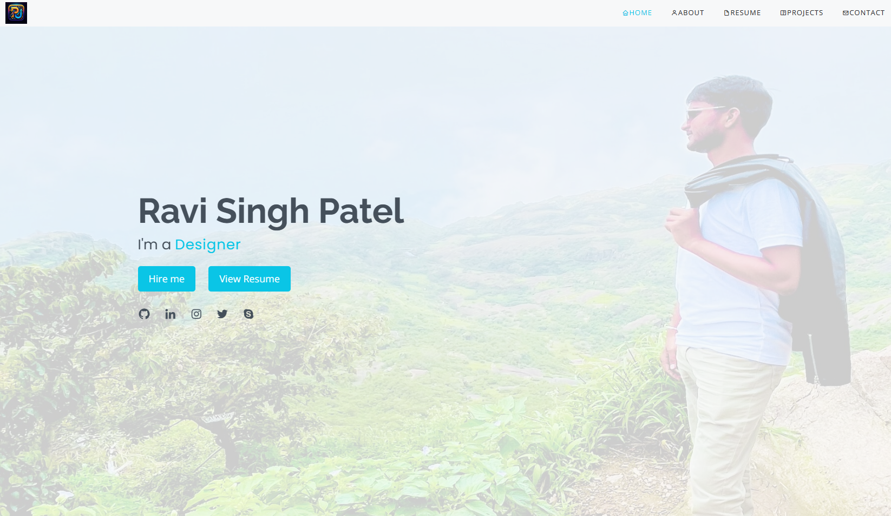
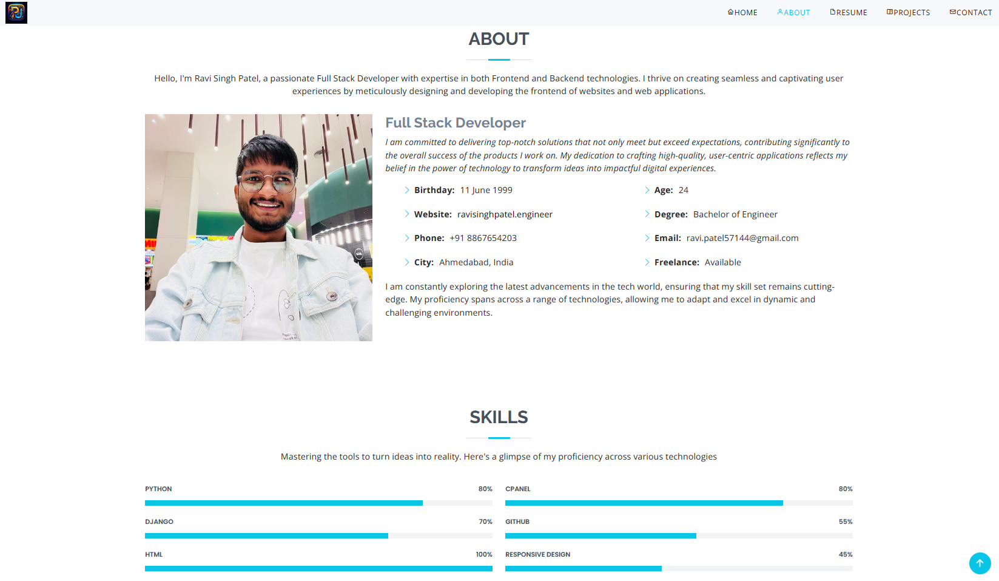
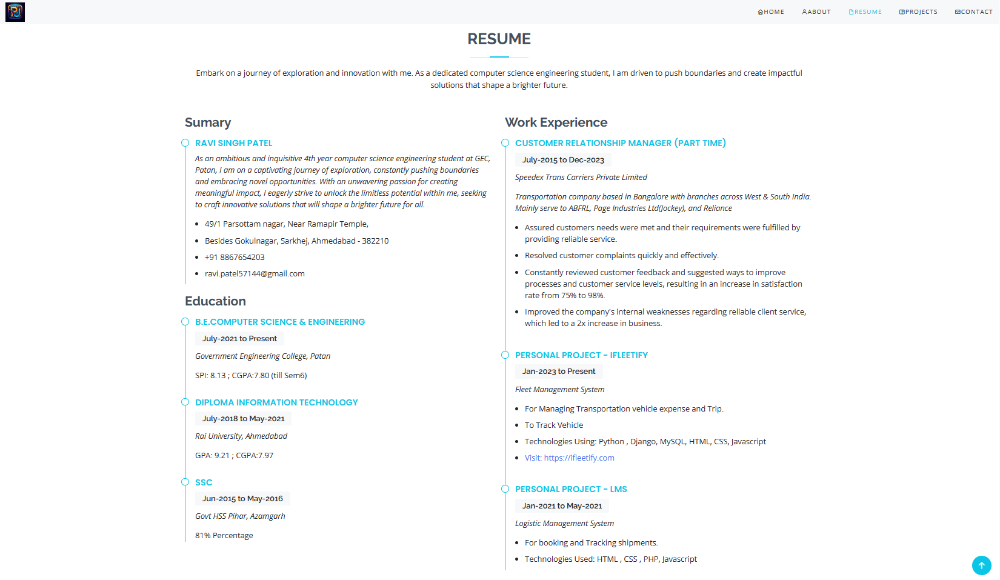
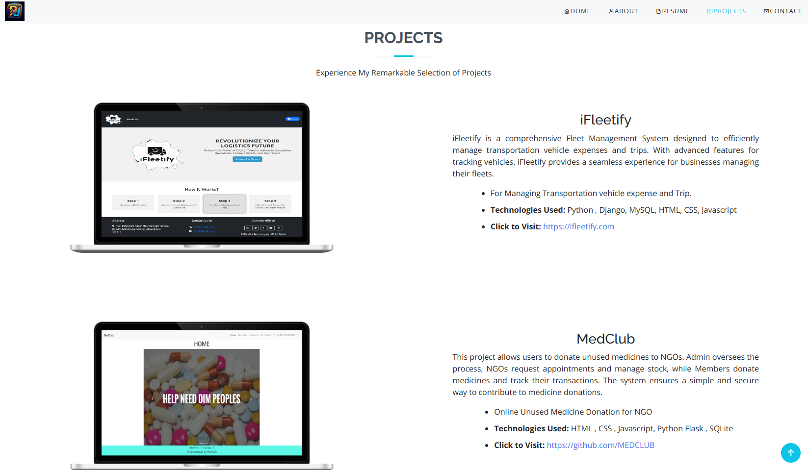
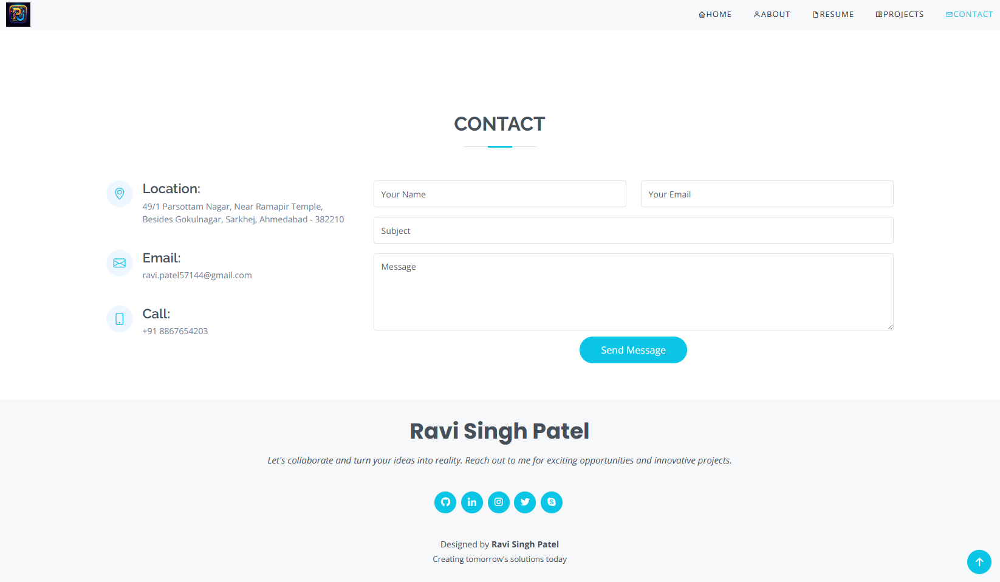
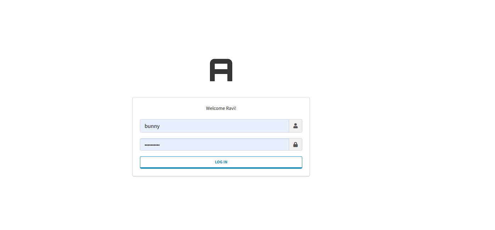
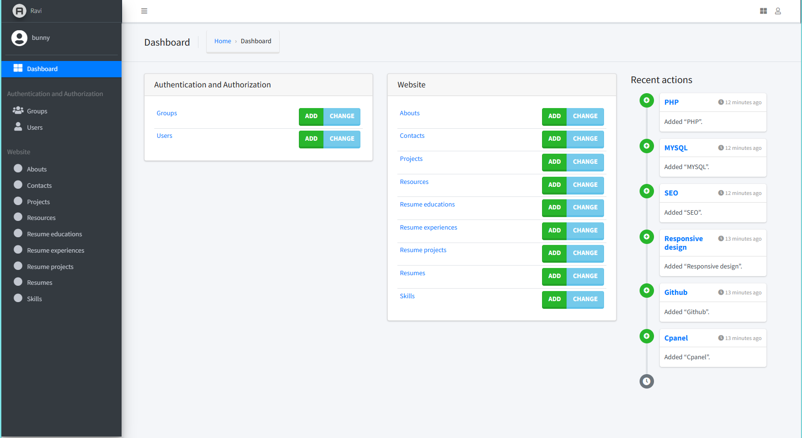

# Personal Portfolio

A dynamic Portfolio website where if we require to change any data we don't need to open code edit we can directly login
to admin panel and change the data as per our requirement.

## Technologies Used

- HTML
- CSS
- Javascript
- Python Django

### Pages - [Click to visit Project](https://ravisinghpatel.dev)

#### Home

#### About

#### Resume

#### Projects

#### Contact

#### Admin Panel Login

#### Admin Panel Dashboard

